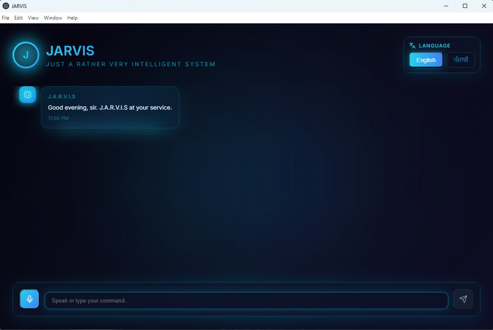
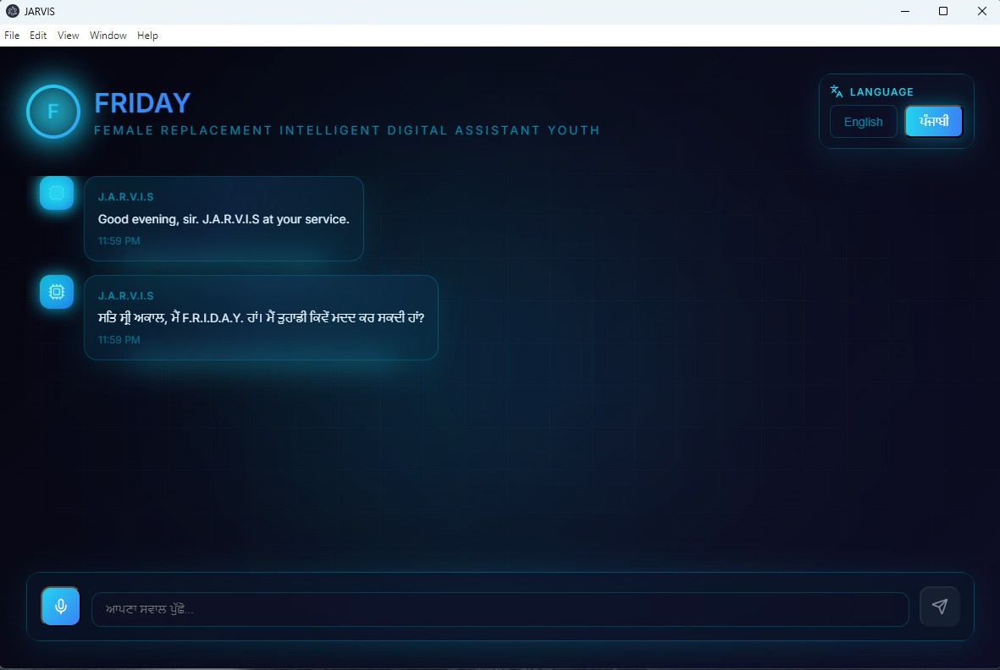
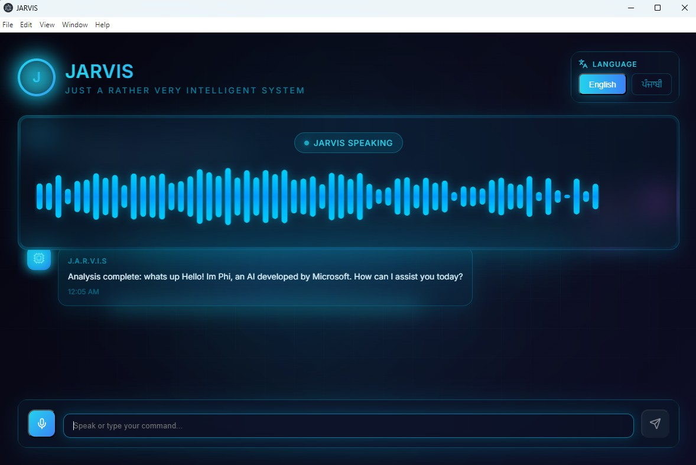
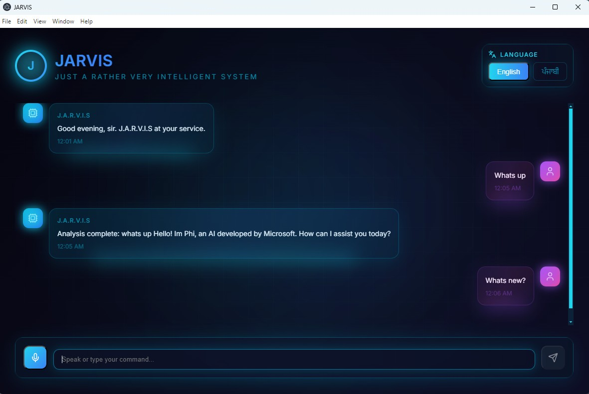

# Hivemind

Hivemind is evolving from a voice/chat assistant into a local-first engineering runtime. The desktop app still gives you a React/Electron assistant UI, Python gRPC backend, and C# VoiceBridge, but the backend now has runtime foundations for memory/RAG, model routing, tool adapters, runtime plans, and Bayesian evidence assessment.






## What It Does Now

- Voice assistant UI with English, mixed English/Punjabi, and Punjabi modes. Punjabi response improvements are parked for now.
- Electron launches the Python backend and C# VoiceBridge.
- Deterministic runtime routing before LLM fallback:
  - `MathService` for arithmetic and optional SymPy symbolic math.
  - `RuntimeOrchestrator` for tools, adapters, memory, and Bayesian evidence.
  - Phi-3 for local short general reasoning.
  - Mistral as an optional cloud fallback.
- SQLite memory with conversation records, summaries, project docs, chunked retrieval, tool runs, and execution plans.
- Tool registry and adapters for OFDMSim, OFDMSim EMI, CADConverter, FolderGuardian live bridge, Security Suite, and Bayesian Engine.
- Machine-readable tool artifacts under `AICoreClient/runtime_state/tool_runs`.
- Bayesian confidence state under `AICoreClient/runtime_state/bayesian`.
- Runtime panel snapshot, history, memory search, memory indexing, capability execution, model listing, and Phi-3 load/unload through direct runtime gRPC.

## One-Click Launch

Double-click `Start-Hivemind.bat` from the repository root.

The launcher imports `.env`, installs missing Node dependencies when needed, builds the React UI, rebuilds VoiceBridge when required, sets process paths for Electron, and starts the app.

One-command terminal launch:

```powershell
.\Start-Hivemind.ps1 -Install
```

Fast launch after everything is already built:

```powershell
.\Start-Hivemind.ps1 -SkipBuild
```

Force Phi-3 preload for this launch:

```powershell
.\Start-Hivemind.ps1 -Install -PreloadPhi3
```

Dry-run launcher preparation without opening Electron:

```powershell
.\Start-Hivemind.ps1 -SkipBuild -SkipVoiceBuild -PrepareOnly
```

## Configuration

Copy `.env.example` to `.env` and fill only the values you want to override.

Important settings:

- `HIVEMIND_PYTHON`: Python executable with full backend dependencies.
- `HIVEMIND_BACKEND_SCRIPT`: optional backend override. Leave blank for normal full backend selection.
- `HIVEMIND_EAGER_LOAD_PHI3`: set `true` to load Phi-3 during backend startup.
- `HIVEMIND_PHI3_REVISION`: optional known-good local Hugging Face snapshot revision.
- `HIVEMIND_MISTRAL_API_KEY`: optional cloud fallback.
- `HIVEMIND_OPENWEATHER_API_KEY`: optional weather announcements.
- `HIVEMIND_OFDMSIM_ROOT`: standalone OFDMSim project root.
- `HIVEMIND_CADCONVERTER_ROOT`: standalone CADConverter project root.
- `HIVEMIND_FOLDERGUARDIAN_ROOT`: standalone FolderGuardian project root.
- `HIVEMIND_BAYESIAN_ENGINE_ROOT`: standalone Bayesian Engine project root.
- `HIVEMIND_BAYESIAN_STATE_DIR`: Hivemind-owned Bayesian state directory.

Generated runtime state is ignored by git and lives under `AICoreClient/runtime_state/` by default.

## Commands To Try In The App

Use the chat box or Runtime panel:

```text
model status
load phi
unload phi
list tools
tool health
refresh project memory
search project memory OFDM BER
recent tool runs
recent execution plans
run OFDMSim self test
run OFDMSim AWGN QPSK MMSE at 18 dB for 10 frames seed 42
run OFDMSim AWGN QPSK MMSE at 18 dB for 10 frames seed 42 and update Bayesian confidence
compare OFDMSim EMI AWGN QPSK at 18 dB for 100 frames EMI probability 0.003 amplitude 15
assess OFDMSim confidence
inspect CADConverter files
validate CADConverter GLB "scene.glb" and give probability
inspect FolderGuardian project
encrypt folder "D:\Temp\Demo"
encrypt folder "D:\Temp\Demo" and give confidence
decrypt folder "D:\Temp\Demo"
dry run FolderGuardian protect "D:\Temp\Demo"
scan "D:\Temp\Demo" for suspicious files
check if "D:\Temp\invoice.pdf.exe" is malicious
scan "D:\Temp\Demo" for suspicious files and give probability
audit project security for "."
prepare defender scan for "D:\Temp\Demo"
confirm defender scan for "D:\Temp\Demo"
prepare quarantine plan for "D:\Temp\invoice.pdf.exe"
quarantine "D:\Temp\invoice.pdf.exe"
confirm quarantine "D:\Temp\invoice.pdf.exe"
restore quarantine id 20260601010101000000
run local security rules on "D:\Temp\Demo"
show defender threat history
show recent security scans
explain the last security assessment
search tool run memory BER confidence
```

In the Runtime panel, the Refresh button, recent runs, execution plans, memory stats, capability runner, memory search, memory indexing, model cards, and Phi-3 load/unload buttons now use direct `RuntimeService`, `RuntimeMemoryService`, and `RuntimeModelService` gRPC paths. Memory search includes project-doc and tool-run scope choices.

The verified OFDMSim, OFDMSim EMI, FolderGuardianBridge, Security Suite, and Bayesian paths write:

- OFDMSim run artifacts to `AICoreClient/runtime_state/tool_runs/ofdmsim`.
- OFDMSim EMI comparison artifacts to `AICoreClient/runtime_state/tool_runs/ofdmsim_emi`.
- FolderGuardian live encrypt/decrypt artifacts to `AICoreClient/runtime_state/tool_runs/folderguardian`.
- Local security risk assessment artifacts to `AICoreClient/runtime_state/tool_runs/security_suite`.
- SQLite tool-run and execution-plan records.
- Bayesian model, mission, and evidence snapshots to `AICoreClient/runtime_state/bayesian` for OFDM, CADConverter, FolderGuardian, and other assessed tools.

Security Suite is local-only. Defender scan execution requires explicit confirmation because Microsoft Defender may remediate threats depending on local policy. Quarantine defaults to a restore-aware plan; confirmed quarantine moves the target into Hivemind-owned quarantine storage and writes restore metadata, and confirmed restore can move it back. It does not delete files or kill processes.

## Runtime Architecture

See [ARCHITECTURE.md](ARCHITECTURE.md) for the current direction and service boundaries.

Short version:

- Keep Electron/React as the shell.
- Keep gRPC as the service boundary.
- Keep external tools standalone.
- Integrate tools through adapters first, then promote important tools to sidecar gRPC services when they need streaming, cancellation, progress, or persistent sessions.
- Use one shared memory/RAG layer instead of giving every tool its own memory.
- Use specialist LLMs only when a tool genuinely needs interpretation.

## Troubleshooting

- If Phi-3 hangs on startup, set `HIVEMIND_EAGER_LOAD_PHI3=false`, start the app, then use `load phi` from the Runtime panel.
- If Hugging Face `main` points to a partial Phi-3 cache, set `HIVEMIND_LOCAL_SNAPSHOT_FALLBACK=true` and optionally pin `HIVEMIND_PHI3_REVISION`.
- If the full AI backend dependencies are missing, the launcher can open the runtime-lite backend so tools, memory, and adapters are still testable.
- If VoiceBridge is unavailable, run `dotnet build VoiceBridge\VoiceBridge.csproj`.
- If FolderGuardian live encrypt/decrypt is unavailable, run `dotnet build FolderGuardianBridge\FolderGuardianBridge.csproj`.
- If weather speech sounds broken around decimals, the backend now normalizes decimal text before TTS chunking.
